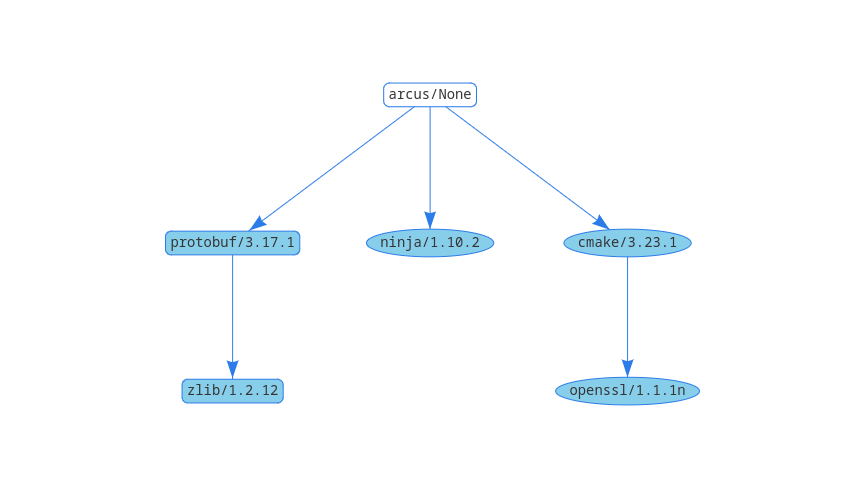

# Arcus

<p align="center">
    <a href="https://github.com/Ultimaker/libArcus/actions/workflows/conan-package.yml" alt="Conan Package">
        </a>
    <a href="https://github.com/Ultimaker/libArcus/issues" alt="Open Issues">
        </a>
    <a href="https://github.com/Ultimaker/libArcus/issues?q=is%3Aissue+is%3Aclosed" alt="Closed Issues">
        </a>
    <a href="https://github.com/Ultimaker/libArcus/pulls" alt="Pull Requests">
        </a>
    <a href="https://github.com/Ultimaker/libArcus/graphs/contributors" alt="Contributors">
        </a>
    <a href="https://github.com/Ultimaker/libArcus" alt="Repo Size">
        </a>
    <a href="https://github.com/Ultimaker/libArcus/blob/master/LICENSE" alt="License">
        </a>
</p>

This library contains C++ code for creating a socket in a thread and using this socket to send and receive messages
based on the Protocol Buffers library. It is designed to facilitate the communication between Cura and its backend and similar code.

## License

  
Arcus is released under terms of the AGPLv3 License. Terms of the license can be found in the LICENSE file. Or at
http://www.gnu.org/licenses/agpl.html

> But in general it boils down to:  
> **You need to share the source of any Arcus modifications if you make an application with Arcus.**

## How to build

> **Note:**  
> We are currently in the process of switch our builds and pipelines to an approach which uses [Conan](https://conan.io/)
> and pip to manage our dependencies, which are stored on our JFrog Artifactory server and in the pypi.org.
> At the moment not everything is fully ported yet, so bare with us.

If you want to develop Cura with Arcus see the Cura Wiki: [Running Cura from source](https://github.com/Ultimaker/Cura/wiki/Running-Cura-from-Source)

If you have never used [Conan](https://conan.io/) read their [documentation](https://docs.conan.io/en/latest/index.html)
which is quite extensive and well maintained. Conan is a Python program and can be installed using pip

```bash
pip install conan --upgrade
conan config install https://github.com/ultimaker/conan-config.git
conan profile new default --detect
```

**Community developers would have to remove the Conan `cura` repository because that one requires credentials.**
```bash
conan remote remove cura
```

### Building Arcus

The steps above should be enough to get your system in such a state you can start development on Arcus. If you want
to use your own system provided CMake and CMake generators, such as: Ninja, Make, NMake use the following steps to
install the dependencies for Arcus. Executed in the root directory of Arcus.

#### Release build type

```shell
conan install . --build=missing --update
cd cmake-build-release
cmake --toolchain=conan/conan_toolchain.cmake ..
cmake --build .
```

#### Debug build type

Use the same instructions as above, but pass the `-s build_type=Debug` flag to the `conan install` command.

```shell
conan install . --build=missing --update -s build_type=Debug
cd cmake-build-debug
cmake --toolchain=conan/conan_toolchain.cmake -DCMAKE_BUILD_TYPE=Debug ..
cmake --build .
```

## Creating a new Arcus Conan package

To create a new Arcus Conan package such that it can be used in Cura and CuraEngine, run the following command:

```shell
conan create . arcus/<version>@<username>/<channel> --build=missing --update
```

This package will be stored in the local Conan cache (`~/.conan/data` or `C:\Users\username\.conan\data` ) and can be used in downstream
projects, such as Cura and CuraEngine by adding it as a requirement in the `conanfile.py` or in `conandata.yml` if that project is set up
in such a way. You can also specify the override at the commandline, to use the newly created package, when you execute the `conan install`
command in the root of the consuming project, with:


```shell
conan install . -build=missing --update --require-override=arcus/<version>@<username>/<channel>
```

## Dependencies



### Runtime dependencies
- [protobuf](docs/development/protobuf.md)
- [zlib](docs/development/zlib.md)

### Build dependencies
- [Python](https://www.python.org/)
- [Cmake](https://cmake.org/)
- [Ninja (optional)](https://ninja-build.org/)
- [GNU-GCC](https://gcc.gnu.org/)
- [Visual Studio](https://visualstudio.microsoft.com/vs/)
- [xcode command line tools](https://developer.apple.com/xcode/)
- [sip](https://pypi.org/project/sip/)

### IDE

If you're using [CLion](https://www.jetbrains.com/clion/) as an IDE be sure to checkout the Conan plugin
[Conan CLion plugin](https://docs.conan.io/en/latest/integrations/ide/clion.html)

## Using arcus with CMake

<br>

### [Conan CMake generators](https://docs.conan.io/en/latest/reference/conanfile/tools/cmake.html)

<br>

* [CMakeDeps](https://docs.conan.io/en/latest/reference/conanfile/tools/cmake/cmakedeps.html): generates information about where the **arcus** library and its dependencies  ( [protobuf](https://conan.io/center/protobuf),  [zlib](https://conan.io/center/zlib)) are installed together with other information like version, flags, and directory data or configuration. CMake will use this files when you invoke ``find_package()`` in your *CMakeLists.txt*.

* [CMakeToolchain](https://docs.conan.io/en/latest/reference/conanfile/tools/cmake/cmaketoolchain.html): generates a CMake toolchain file the you can later invoke with CMake in the command line using `-DCMAKE_TOOLCHAIN_FILE=conantoolchain.cmake`.

Declare these generators in your **conanfile.txt** along with your **arcus** dependency like:

```ini
[requires]
arcus/(latest)@ultimaker/stable

[generators]
CMakeDeps
CMakeToolchain
```

<br>

To use **arcus** in a simple CMake project with this structure:

```shell
.
|-- CMakeLists.txt
|-- conanfile.txt
`-- src
    `-- main..cpp
```

<br>

Your **CMakeLists.txt** could look similar to this, using the global **arcus::arcus** CMake's target:

```cmake
cmake_minimum_required(VERSION 3.15)
project(arcus_project CXX)

find_package(arcus)

add_executable(${PROJECT_NAME} src/main.cpp)

# Use the global target
target_link_libraries(${PROJECT_NAME} arcus::arcus)
```

<br>

To install **arcus/latest@ultimaker/stable**, its dependencies and build your project, you just have to do:

```shell
# for Linux/macOS
$ conan install . --install-folder cmake-build-release --build=missing
$ cmake . -DCMAKE_TOOLCHAIN_FILE=cmake-build-release/conan_toolchain.cmake
$ cmake --build .

# for Windows and Visual Studio 2017
$ conan install . --output-folder cmake-build --build=missing
$ cmake . -G "Visual Studio 15 2017" -DCMAKE_TOOLCHAIN_FILE=cmake-build/conan_toolchain.cmake
$ cmake --build . --config Release
```


<br>


As the arcus Conan package defines components you can link only that desired part of the library in your project. For example, linking only with the arcus **libarcus** component, through the **arcus::libarcus** target.

```cmake
target_link_libraries(${PROJECT_NAME} arcus::arcus)
```

<br>

To check all the available components for **arcus** Conan package, please check the dedicated section at the end of this document.


## Using the Socket


The socket assumes a very simple and strict wire protocol: one 32-bit integer with
a header, one 32-bit integer with the message size, one 32-bit integer with a type id
then a byte array containing the message as serialized by Protobuf. The receiving side
checks for these fields and will deserialize the message, after which it can be processed 
by the application.

To send or receive messages, the message first needs to be registered on both sides with 
a call to `registerMessageType()`. You can also register all messages from a Protobuf 
 .proto file with a call to `registerAllMessageTypes()`. For the Python bindings, this 
is the only supported way of registering since there are no Python classses for 
individual message types.

The Python bindings expose the same API as the Public C++ API, except for the missing
`registerMessageType()` and the individual messages. The Python bindings wrap the
messages in a class that exposes the message's properties as Python properties, and
can thus be set the same way you would set any other Python property. 

The exception is repeated fields. Currently, only repeated messages are supported, which
can be created through the `addRepeatedMessage()` method. `repeatedMessageCount()` will
return the number of repeated messages on an object and `getRepeatedMessage()` will get
a certain instance of a repeated message. See python/PythonMessage.h for more details.

Origin of the Name
==================

The name Arcus is from the Roman god Arcus. This god is the roman equivalent of
the goddess Iris, who is the personification of the rainbow and the messenger
of the gods.

Java
====
There is a Java port of libArcus, which can be found [here](https://github.com/Ocarthon/libArcus-Java).
